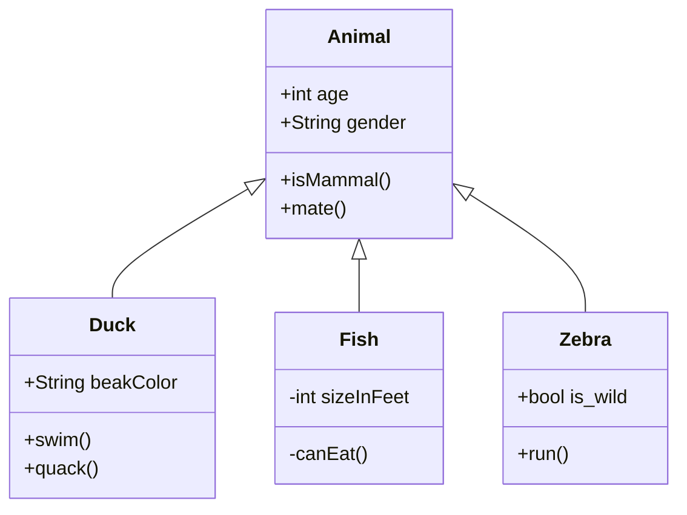

<SwmSnippet path="/force-app/main/default/classes/AnimalsCallouts.cls" line="2" collapsed>

---

This Method used to make callout to get animals list from heroku

```apex
    public static HttpResponse makeGetCallout() {
        Http http = new Http();
        HttpRequest request = new HttpRequest();
        request.setEndpoint('https://th-apex-http-callout.herokuapp.com/animals');
        request.setMethod('GET');
        HttpResponse response = http.send(request);
        // If the request is successful, parse the JSON response.
        if(response.getStatusCode() == 200) {
            // Deserializes the JSON string into collections of primitive data types.
            Map<String, Object> results = (Map<String, Object>) JSON.deserializeUntyped(response.getBody());
            // Cast the values in the 'animals' key as a list
            List<Object> animals = (List<Object>) results.get('animals');
            System.debug('Received the following animals:');
            for(Object animal: animals) {
                System.debug(animal);
            }
        }
        return response;
    }
```

---

</SwmSnippet>

<SwmSnippet path="/force-app/main/default/classes/AnimalsCallouts.cls" line="21" collapsed>

---

This Method used to handle the response from callout .

```apex
    public static HttpResponse makePostCallout() {
        Http http = new Http();
        HttpRequest request = new HttpRequest();
        request.setEndpoint('https://th-apex-http-callout.herokuapp.com/animals');
        request.setMethod('POST');
        request.setHeader('Content-Type', 'application/json;charset=UTF-8');
        request.setBody('{"name":"mighty moose"}');
        HttpResponse response = http.send(request);
        // Parse the JSON response
        if(response.getStatusCode() != 201) {
            System.debug('The status code returned was not expected: ' +
                response.getStatusCode() + ' ' + response.getStatus());
        } else {
            System.debug(response.getBody());
        }
        return response;
    }        
```

---

</SwmSnippet>



&nbsp;

<SwmMeta version="3.0.0" repo-id="Z2l0aHViJTNBJTNBYXJpJTNBJTNBYXNod2luYXJlbg==" repo-name="ari"><sup>Powered by [Swimm](https://app.swimm.io/)</sup></SwmMeta>
